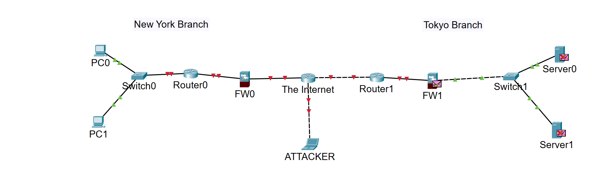

# Day 01 - Packet Tracer Introduction

## Objective

Learn how to use Cisco Packet Tracer by recreating a simple enterprise network topology.

## What I Practiced

- Navigating the Packet Tracer interface
- Placing routers, switches, firewalls, PCs, and servers
- Renaming network devices
- Connecting devices automatically
- Understanding a basic enterprise network topology

## Devices Used

- Cisco 2911 Routers
- Cisco 2960 Switches
- Cisco ASA 5505 Firewalls
- PCs
- Servers
- Laptop (Attacker)

## Network Topology

## Skills Learned

- Cisco Packet Tracer basics
- Enterprise network topology
- Device placement
- Cable auto-selection

## Reflection

Today I learned how to use Cisco Packet Tracer and recreated a simple enterprise network. Although no device configuration was required in this lab, it provided a solid foundation for future CCNA labs.
